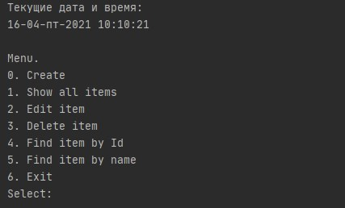

## Стажировка Jobj4

## Репозиторий содержит проекты стажировки в Jobj4.
1. ООП (Наследование, Инкапсуляция, Полиморфизм, Внутренние класы, Абстрактные классы, Исключения, Шаблоны проектирования, Синглетон, Декоратор, Стратегия, Фабрика) 
2. Мини-проект: Трекер заявок. взаимодействие через консоль.
3. Вводный курс Коллекции Lite, Collections Framework.(Коллекции List, Set, Map, ArrayList, Сортировка, Обобщения, Итераторы,)
4. Lambda и Stream API.
5. Инструменты: Checkstyle с Maven, JaCoCo, Travic CI, JavaDoc

Подробнее о проекте "Трекер". 
Проект "Трекер" является упрощенной моделью корпоративных проектов.
Этот проект - консольное приложение.
Пользователю отображается меню с возможностями программы.

Программа может:
1. Добавлять заявку.
2. Заменять заявку на новою заявку по ID.
3. Удалять заявку по ID.
4. Отображать список всех заявок.
5. Производить поиск по имени заявки.

